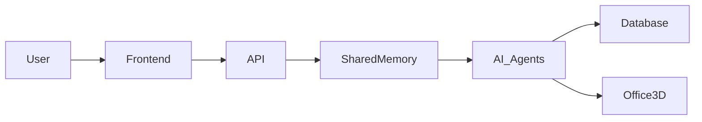
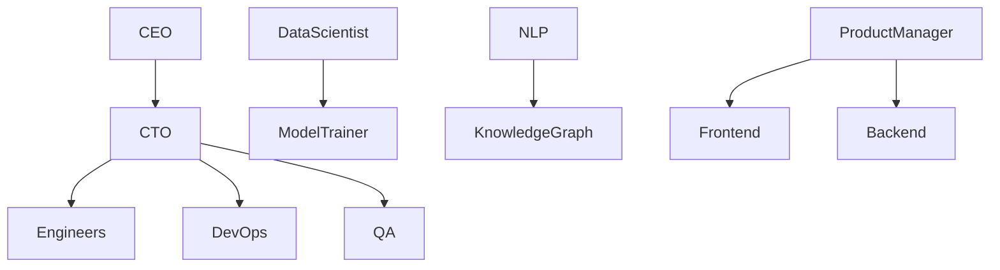

<p align="center">
  
</p>

<h1 align="center">🚀 AI Workforce Framework 🧠</h1>

<p align="center">
AI-Powered Autonomous Software Development Company
</p>

<p align="center">


</p>

---

# 🌐 Immersive 3D Office Environment

Experience the future of remote collaboration through a fully immersive AI-powered 3D corporate workspace.

The platform visualizes autonomous AI employees collaborating in real-time inside a modern virtual office environment featuring intelligent behaviors, realistic animations, and seamless inter-agent communication.

---

# ✨ Features

## 🧑‍💼 Interactive 3D Employee Models

Watch AI employees come to life with realistic workplace simulations.

### Capabilities
- ⌨️ Typing on keyboards
- 📞 Making phone calls
- 🤝 Team collaboration
- 🧠 AI-driven interactions
- 🚶 Natural movement animations
- 💬 Dynamic conversations

---

## 🏢 Modern Corporate Office Design

Explore a highly realistic enterprise workspace inspired by modern tech companies.

### Office Includes
- Ergonomic desks and chairs
- Smart meeting rooms
- Collaborative workspaces
- Lounge and brainstorming areas
- Multi-department office layouts
- Realistic textures and lighting

---

## 🤖 AI-Powered Lifelike Animations

Advanced AI systems simulate realistic employee activities and behaviors.

### Realistic Behaviors
- Walking and navigation
- Sitting and standing transitions
- Team collaboration
- Task-oriented activities
- Environmental responsiveness
- Autonomous workplace interactions

---

# 👥 Meet the AI Workforce

Our AI ecosystem consists of 20 highly specialized autonomous agents.

| Role | Description |
|------|-------------|
| 💼 Chief Executive Officer (CEO) | Strategic leadership and business direction |
| 💻 Chief Technology Officer (CTO) | Technical architecture and innovation |
| 📊 Data Scientist | Predictive analytics and AI insights |
| 👨‍💻 Software Engineer | Backend and software development |
| ⚙️ DevOps Engineer | Infrastructure automation and CI/CD |
| ✅ QA Engineer | Testing and validation |
| 🔬 Research Scientist | AI experimentation and innovation |
| 📈 Business Analyst | Business intelligence and analytics |
| 📝 Technical Writer | Documentation systems |
| 🎨 UX/UI Designer | User experience and interfaces |
| 🏋️‍♂️ Model Trainer | AI model optimization |
| ⚖️ Model Evaluator | Performance benchmarking |
| 🕸️ Knowledge Graph Engineer | Knowledge systems architecture |
| 🗣️ NLP Specialist | Language understanding systems |
| 🛡️ Security Engineer | Cybersecurity and protection |
| 📦 Product Manager | Product strategy and planning |
| ☁️ Cloud Architect | Cloud scalability systems |
| ⚖️ Ethics Officer | Responsible AI governance |
| 🖥️ Frontend Developer | Interactive UI systems |
| 🗄️ Backend Developer | APIs and distributed systems |

---

# 🧠 Shared Memory Framework

The AI Workforce Framework uses a centralized shared memory architecture enabling all agents to:

- Share contextual information
- Collaborate intelligently
- Maintain organizational memory
- Coordinate workflows
- Track project states
- Improve decision-making consistency
- Synchronize autonomous operations

---

# ⚡ Core Capabilities

## 🧩 Autonomous Collaboration
AI agents communicate and coordinate tasks automatically.

## 📚 Persistent Organizational Memory
Shared memory enables long-term contextual awareness.

## 🔄 Real-Time Workflow Coordination
Dynamic task prioritization and synchronization.

## 🧠 Multi-Agent Intelligence
Distributed enterprise-grade AI collaboration.

## 🏢 Virtual Enterprise Simulation
Simulates a fully operational AI software company.

---

# 🎬 Live AI Workforce Preview

<p align="center">
  
</p>

---

# 🛰️ System Architecture



---

# 🔥 AI Collaboration Workflow



---

# 🚀 Technologies Used

## Frontend
- React.js
- Next.js
- Tailwind CSS
- Three.js
- React Three Fiber (R3F)
- Framer Motion

## Backend
- Python
- FastAPI
- Node.js
- Express.js

## AI & Machine Learning
- LangChain
- CrewAI
- AutoGen
- OpenAI / Groq API
- Hugging Face Transformers

## 3D & Animation
- Blender
- WebGL
- GSAP
- AI Animation Systems

## Infrastructure
- Docker
- Kubernetes
- AWS / GCP / Azure
- Redis
- PostgreSQL
- ChromaDB

---

# 📂 Project Structure

```bash
AI-Workforce-Framework/
│
├── agents/
├── shared_memory/
├── office_3d/
├── frontend/
├── backend/
├── animations/
├── models/
├── api/
├── infrastructure/
├── docs/
├── assets/
│   ├── office-live-demo.gif
│   ├── ai-workers.gif
│   └── preview.png
│
├── roles.md
├── requirements.txt
├── package.json
└── README.md
```

---

# ⚙️ Installation

## Clone Repository

```bash
git clone https://github.com/your-username/AI-Workforce-Framework.git
```

## Navigate to Project

```bash
cd AI-Workforce-Framework
```

## Install Backend Dependencies

```bash
pip install -r requirements.txt
```

## Install Frontend Dependencies

```bash
npm install
```

---

# ▶️ Running the Application

## Start Backend

```bash
python app.py
```

## Start Frontend

```bash
npm run dev
```

---

# 🌐 Open Application

```bash
http://localhost:3000
```

---

# 🎯 Use Cases

- AI Workforce Simulation
- Autonomous AI Companies
- Virtual Remote Workspaces
- Multi-Agent Collaboration Systems
- Enterprise Automation
- AI Research Platforms
- Smart Corporate Training
- Interactive 3D Demonstrations
- Metaverse Office Environments

---

# 🔮 Future Enhancements

- 🥽 VR Office Integration
- 🎤 Voice-enabled AI Employees
- 🌍 Multiplayer Collaboration
- 🤝 Real-Time AI Meetings
- 🧠 Self-Learning Agent Ecosystem
- 📡 Cloud Synchronization
- 🕹️ Gesture-Based Interactions
- 🤖 Autonomous AI Decision Systems

---

# 📸 Preview

> A next-generation AI-powered enterprise where autonomous agents collaborate inside a fully immersive 3D corporate office environment.

---

# 🤝 Contributing

Contributions are welcome.

Feel free to:
- Improve AI agent collaboration
- Add new employee roles
- Enhance 3D office environments
- Optimize animations
- Extend shared memory systems
- Build enterprise automation modules

---

# 📜 License

This project is licensed under the MIT License.

---

# 💡 Vision

Our mission is to redefine the future of work through intelligent autonomous AI systems, immersive virtual office environments, and collaborative multi-agent enterprise architectures.

---

# ⭐ Support

If you like this project, consider giving it a ⭐ on GitHub to support future development.

---

# ⚠️ IMPORTANT

For the README animations to work correctly:

Create an `assets` folder in your repository and upload:

- `office-live-demo.gif`
- `ai-workers.gif`
- `preview.png`

Example:

```bash
assets/
├── office-live-demo.gif
├── ai-workers.gif
└── preview.png
```

Without these files, GitHub will show broken images.
