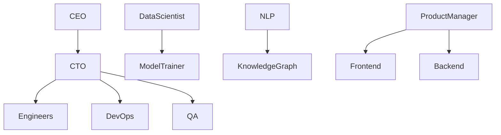
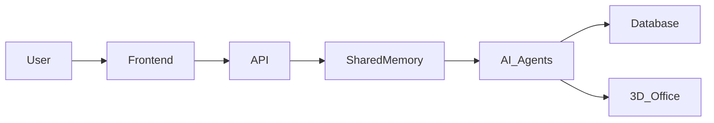

# 🌐 Live 3D Office Preview

  

---

# 🎥 Live Demo

## 🚀 Experience the AI Workforce in Action

👉 [Launch Live Demo](https://your-live-demo-link.com)

---

# 🖼️ 3D Office Environment

  
  

---

# 🎬 AI Employees Working in Real-Time

  

---

# ⚡ Interactive Features

| Feature | Status |
|----------|---------|
| 🧠 AI Agents | ✅ Active |
| 🌐 Shared Memory | ✅ Running |
| 🏢 3D Office | ✅ Enabled |
| 🤖 Autonomous Collaboration | ✅ Live |
| 🎤 Voice AI | 🚧 Coming Soon |
| 🥽 VR Support | 🚧 Planned |

---

# 📹 Product Walkthrough

---

# 🔥 Real-Time AI Workforce Visualization

---

# 🛰️ System Architecture

---

# 🌟 Live Status Dashboard

